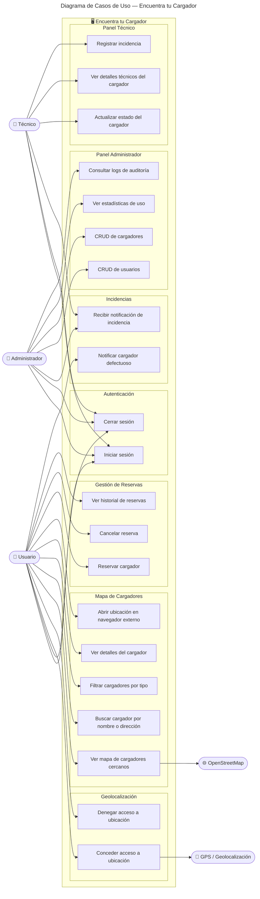

<!-- [MermaidChart: 4dc6c28d-8645-4e4a-86df-806aa60d39a0] -->

```mermaid
---
title: Diagrama de Casos de Uso — Encuentra tu Cargador
---
flowchart LR
    Usuario(["👤 Usuario"])
    Administrador(["👤 Administrador"])
    Tecnico(["👤 Técnico"])
    OpenStreetMap(["🌐 OpenStreetMap"])
    GPS(["📡 GPS / Geolocalización"])

    subgraph Sistema["🖥️ Encuentra tu Cargador"]

        subgraph Auth["Autenticación"]
            UC1["Iniciar sesión"]
            UC2["Cerrar sesión"]
        end

        subgraph Geolocalizacion["Geolocalización"]
            UC3["Conceder acceso a ubicación"]
            UC4["Denegar acceso a ubicación"]
        end

        subgraph MapaCargadores["Mapa de Cargadores"]
            UC5["Ver mapa de cargadores cercanos"]
            UC6["Buscar cargador por nombre o dirección"]
            UC7["Filtrar cargadores por tipo"]
            UC8["Ver detalles del cargador"]
            UC9["Abrir ubicación en navegador externo"]
        end

        subgraph GestionReservas["Gestión de Reservas"]
            UC10["Reservar cargador"]
            UC11["Cancelar reserva"]
            UC12["Ver historial de reservas"]
        end

        subgraph Incidencias["Incidencias"]
            UC13["Notificar cargador defectuoso"]
            UC14["Recibir notificación de incidencia"]
        end

        subgraph PanelAdmin["Panel Administrador"]
            UC15["CRUD de usuarios"]
            UC16["CRUD de cargadores"]
            UC17["Ver estadísticas de uso"]
            UC18["Consultar logs de auditoría"]
        end

        subgraph PanelTecnico["Panel Técnico"]
            UC19["Actualizar estado del cargador"]
            UC20["Ver detalles técnicos del cargador"]
            UC21["Registrar incidencia"]
        end

    end

    Usuario --> UC1
    Usuario --> UC2
    Usuario --> UC3
    Usuario --> UC4
    Usuario --> UC5
    Usuario --> UC6
    Usuario --> UC7
    Usuario --> UC8
    Usuario --> UC9
    Usuario --> UC10
    Usuario --> UC11
    Usuario --> UC12
    Usuario --> UC13

    Administrador --> UC1
    Administrador --> UC2
    Administrador --> UC14
    Administrador --> UC15
    Administrador --> UC16
    Administrador --> UC17
    Administrador --> UC18

    Tecnico --> UC1
    Tecnico --> UC2
    Tecnico --> UC14
    Tecnico --> UC19
    Tecnico --> UC20
    Tecnico --> UC21

    UC5 --> OpenStreetMap
    UC3 --> GPS
```